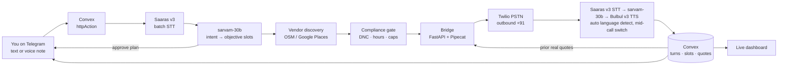

<div align="center">

# Doot

**The calling envoy that finds out, and negotiates, for you.**

You give it one goal. It calls real businesses on the real phone network, asks and haggles in their own language, and brings back one ranked answer sheet while you do something else.

[](https://www.sarvam.ai/)
[](https://www.convex.dev/)
[](https://core.telegram.org/bots)
[](LICENSE)
[](docs/BUILD-SPEC.md)

</div>

---

## Overview

Getting one real answer out of the offline world still means you, on the phone, one call at a time, in a language you half speak. Doot removes that. You send a goal over Telegram — text or a voice note. Doot places outbound calls, holds a natural conversation with each business in their own language, gets the answers, negotiates where that applies, and returns a single ranked sheet.

The name comes from *doot* (दूत), an envoy sent to speak on your behalf.

## The core idea

Doot calls several places for one goal and **keeps every answer**. That lets it do the thing a person on a phone cannot:

> **Cross-call leverage.** Call three cites a real price that call one actually produced ninety seconds earlier — *"Calangute is quoting 3,200, can you do better?"* You call serially and forget the first quote by the fourth call. Doot carries every quote forward, and each call is strictly stronger than the last.

Every citation resolves to a row in the database with a phone number, a timestamp, and the exact transcript line where the price was spoken. Nothing is invented.

## Three mission types, one conversation

Haggling isn't the only reason to call. Most of the time you just want to know something that only exists behind a phone number — *is it in stock, is the room free, do you deliver to 560102.*

```
availability  ⊂  quote  ⊂  negotiate
```

These are not three products. They're the same conversation stopped at different points.

| Type | Conversation | Length |
| :--- | :--- | :--- |
| `availability` | greet → disclose → ask → confirm → thank | 45–90 s |
| `quote` | + ask the price, don't haggle | 90–150 s |
| `negotiate` | + anchor, counter, concede, close | 3–4 min |

Every mission declares **objective slots** it must come back having filled. The agent fills them, then reads the whole deal back in one clean sentence and gets a yes.

## How it works



Calls run **sequentially**, not in parallel — that's what makes the leverage mechanic deterministic, since call N can only cite a quote call N−1 actually finished producing.

## Built on Sarvam AI

Selected capability: **Voice Experience**. The product lives or dies on whether Doot can hold a real, code-mixed, noisy phone call and get a straight answer out of it.

| Component | Role |
| :--- | :--- |
| **Saaras v3** | Streaming STT on the phone leg and batch STT for Telegram voice notes. 23 languages, code-mixed, automatic language detection. `mode="translate"` also covers the cross-language bridge. |
| **Bulbul v3** | Doot's voice. Firm when anchoring, warm when closing, deliberate on numbers. Switches language mid-call when the callee does. |
| **sarvam-30b** | The in-call brain — one short spoken turn at a time, under a hard latency budget. |
| **sarvam-105b** | Offline structured extraction, summaries, and the deal comparison. Never in the live loop. |
| **Mayura + transliterate** | English toggle and romanised captions on the dashboard transcript. |

Eight distinct Sarvam surfaces in one call flow. See [BUILD-SPEC §7](docs/BUILD-SPEC.md).

## Language handling

Set `language="unknown"` on the STT socket and Saaras returns the detected language and a confidence score on every utterance. When the callee switches, Doot switches — gated on two consecutive confident finals so it doesn't flap.

One asymmetry that matters: **STT covers 23 languages, TTS covers 11.** Doot can transcribe Maithili and cannot answer in it, so every switch is checked against the TTS set first.

## Tech stack

| Layer | Choice |
| :--- | :--- |
| Interface | Telegram Bot API, served directly from a Convex `httpAction` — no separate Node process |
| Voice pipeline | Pipecat, with Sarvam's official Twilio integration |
| Telephony | Twilio outbound, US caller ID → +91, `<Connect><Stream>` media streams |
| Data | Convex — schema, reactive queries, scheduler, file storage |
| Dashboard | Vite + React + shadcn/ui, live transcripts over Convex reactivity |

## Documentation

**[docs/BUILD-SPEC.md](docs/BUILD-SPEC.md) is the single source of truth** — architecture, Convex schema, the Sarvam endpoint table, negotiation prompt pack, compliance constants, five-lane workstream contracts with frozen interfaces, hour-by-hour plan, demo script, risk register, and the open questions with the experiment that closes each.

## Quickstart

```bash
git clone https://github.com/Aniketvish0/bargain-voice-agent.git
cd bargain-voice-agent
npm install
cp .env.example .env            # Sarvam, Telegram, Twilio, Convex
npx convex dev                  # sync the backend
```

Then read [BUILD-SPEC §3](docs/BUILD-SPEC.md) before anything else — the telephony account has gates that take longer than the code does.

## Trust and consent

Designed in, not bolted on.

- Every call opens by disclosing that it is an AI assistant calling on behalf of a named person, and that the call is recorded. The wording used is logged per call.
- A human approves the plan before anything dials.
- Do-not-call requests are honoured immediately, permanently, and across all users.
- Doot never states a competing price it did not actually obtain on an earlier call.
- Doot never books, pays, or asks for an OTP, UPI ID, or any identity document.
- Call caps stay under TRAI's bulk-communication thresholds, and calls only go out between 10:00 and 20:00 IST.

## License

Released under the [MIT License](LICENSE).
