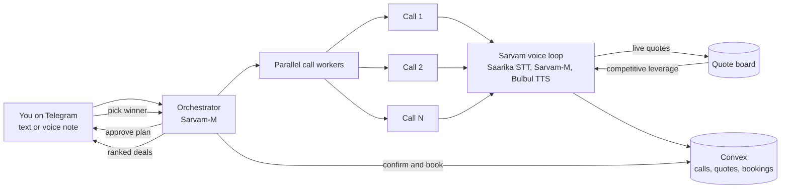

<div align="center">

# Doot

**The calling envoy that negotiates for you.**

You give it one goal. It calls ten places at once, haggles each one down in their own language, and brings back the best deal while you do something else.

[](https://www.sarvam.ai/)
[](https://www.convex.dev/)
[](https://core.telegram.org/bots)
[](LICENSE)
[](docs/ROADMAP.md)

</div>

---

## Overview

Getting one real answer out of the offline world still means you, on the phone, one call at a time, in a language you half speak. Doot removes that entirely. You send a goal and a budget over Telegram. Doot places several outbound calls in parallel, holds a natural conversation with each business in their own language, negotiates on price, and returns a single ranked deal sheet. You approve, it books.

The name comes from *doot* (दूत), an envoy sent to speak on your behalf.

## The core idea

Doot calls N places at the same time and keeps every quote live. That lets it do the one thing a person on a phone cannot:

> **Parallel competitive leverage.** While still on the line with one business, Doot references the best competing quote it is holding from another live call. "The place nearby is offering 3,600. Can you do better?" You call serially and forget the first quote by the fourth call. Doot runs the whole set as a live auction and drives every price down at once.

This single mechanic is the product. Everything else supports it.

## Screenshots

> Screenshots and a demo recording will be added here.

<div align="center">

<table>
  <tr>
    <td align="center"><br/><sub>1. Send a goal, approve the plan</sub></td>
    <td align="center"><br/><sub>2. Parallel calls negotiating live</sub></td>
  </tr>
  <tr>
    <td align="center"><br/><sub>3. Ranked deal sheet</sub></td>
    <td align="center"><br/><sub>4. Booked, with confirmation number</sub></td>
  </tr>
</table>

</div>

## How it works



The result: you make zero calls, and the wall clock is roughly the length of a single call, not the sum of all of them.

## Human in the loop

Doot is neither fully autonomous nor something you babysit. It stops at three points only.

| Point | When | What you do |
| :--- | :--- | :--- |
| A | Before dialing | Approve the plan: who it calls, what it asks, the target and walk-away price |
| B | Mid call | A business asks something outside policy. Doot pauses that one call, sends you a yes or no, then resumes |
| C | Closing | You pick the winner. Doot books it, or hands you the final personal step such as payment or ID |

## Built on Sarvam AI

Selected capability: **Voice Experience**. The product depends on holding a real, code-mixed, noisy phone call and negotiating on it.

| Component | Role |
| :--- | :--- |
| Saarika | Streaming speech to text for the business side. Handles accents, Hindi and English code switching, background noise, and corrections |
| Bulbul | Doot's own voice. Firm when anchoring a price, warm when closing, deliberate on numbers |
| Sarvam-M | The negotiation brain, slot filling, cross call leverage, ranking, and Telegram reasoning |
| Saaras | Optional. Bridges your language and the business language when they differ |

## Tech stack

| Layer | Choice |
| :--- | :--- |
| Interface | Telegram Bot API |
| Orchestration and workers | Node or Python service with a bounded parallel call pool |
| Voice | Sarvam Saarika, Bulbul, and Sarvam-M over streaming APIs |
| Telephony | Twilio Media Streams for the phone line and real time audio. Samvaad by Sarvam is the managed upgrade path |
| Data | Convex for durable state, functions, and the live quote board |

## Documentation

| Document | Contents |
| :--- | :--- |
| [docs/PRD.md](docs/PRD.md) | Problem, user, job to be done, features, Sarvam usage |
| [docs/ARCHITECTURE.md](docs/ARCHITECTURE.md) | System design, per call voice loop, concurrency, latency budget |
| [docs/BARGAINING.md](docs/BARGAINING.md) | The negotiation engine and parallel competitive leverage |
| [docs/DATA_MODEL.md](docs/DATA_MODEL.md) | Data model, state machine, traceability |
| [docs/DEMO.md](docs/DEMO.md) | The three minute demo script |
| [docs/RUBRIC.md](docs/RUBRIC.md) | Mapping to the Sarvam and GrowthX judging rubric |
| [docs/ROADMAP.md](docs/ROADMAP.md) | Build order, milestones, and what to cut |

## Quickstart

```bash
git clone https://github.com/Aniketvish0/bargain-voice-agent.git
cd bargain-voice-agent
npm install
cp .env.example .env            # Sarvam, Telegram, and telephony keys
npx convex dev                  # sync the Convex backend
```

The Convex backend is already provisioned. See [docs/ARCHITECTURE.md](docs/ARCHITECTURE.md) for the service layout, and [docs/ROADMAP.md](docs/ROADMAP.md) for the recommended build order. The critical path to verify first is telephony.

## Trust and consent

Trust is designed in, not added later.

- Every call opens by disclosing that it is an AI assistant calling on behalf of a named person.
- Do not call requests are honored and logged.
- Every call keeps a signed recording and transcript, so any quoted price is provable rather than claimed.
- Payment and identity steps are never automated. They always route back to you.

## License

Released under the [MIT License](LICENSE).
