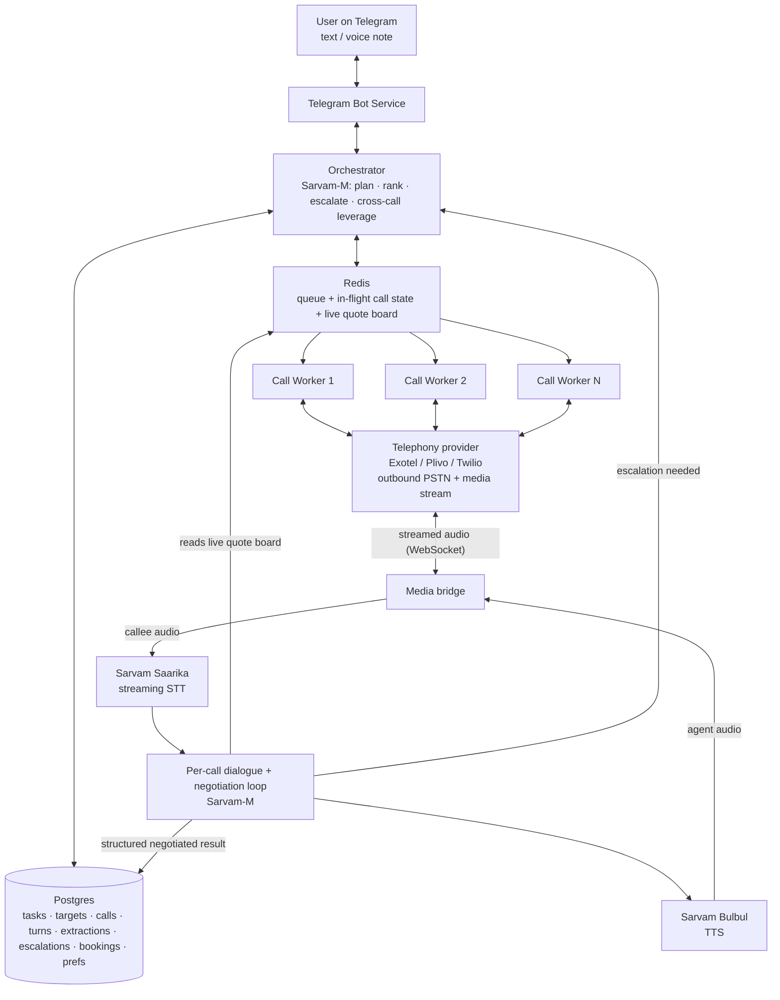
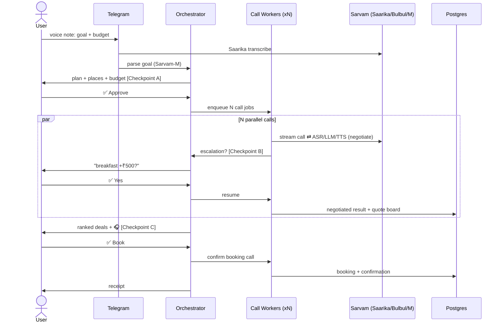

# Doot — Technical Architecture

> How the calling envoy works under the hood: components, the latency-critical per-call voice loop, concurrency, the negotiation engine's place in the flow, and the stack.

---

## 1. System overview



## 2. Components

| Component | Responsibility |
|---|---|
| **Telegram Bot Service** | The only human interface. Accepts goal (text/voice note → Saarika), renders plan + ranked deals as messages with inline-keyboard buttons, routes button callbacks back to the Orchestrator. |
| **Orchestrator** | Owns task-level state: parses goal → structured task + constraints + budget/walk-away (Sarvam-M), runs Checkpoint A, fans out call jobs, aggregates results as calls finish, runs the **cross-call leverage** logic, ranks, routes Checkpoint-B escalations, drives Checkpoint C + booking. |
| **Call Workers** | One per active call. Run the per-call voice + negotiation loop (§3). Stateless beyond Redis. |
| **Media bridge** | Terminates the telephony WebSocket audio stream; pipes callee audio → Saarika and Bulbul audio → the call. Handles VAD + barge-in. |
| **Postgres** | Durable record of everything (see [`DATA_MODEL.md`](DATA_MODEL.md)). Every fact traceable to a call + turn + recording. |
| **Redis** | Job queue (concurrency cap), resumable in-flight call state, and the **live quote board** the negotiation engine reads for competitive leverage. |

## 3. The per-call voice + negotiation loop (latency-critical)

Each worker runs this with a target turn latency **< ~1s** so turn-taking feels human:

1. Telephony provider bridges the PSTN call and **streams audio over WebSocket** (Twilio Media Streams / Plivo Audiostream / Exotel voicebot stream) to the media bridge.
2. Callee audio → **Saarika streaming ASR** → partial + final transcripts.
3. On end-of-utterance (VAD + Saarika finals), **Sarvam-M** decides the next turn from: the call script, filled slots, the **negotiation state** (current offer, target, walk-away, concessions used), and the **live quote board** (best competing quote so far).
4. Response text → **Bulbul TTS** (streamed in small chunks so speech starts fast) → back through the media bridge to the callee.
5. **Barge-in:** if the callee talks during Bulbul playback, stop TTS immediately and listen — never talk over them (explicit rubric requirement).
6. Loop until slots are filled and negotiation terminates (deal at/under target, walk-away hit, or "call back later"). Write a **structured negotiated extraction** row + push the final price to the quote board.

### Turn state machine (per call)
```
GREET/DISCLOSE → QUALIFY (availability, base price)
   → NEGOTIATE ⇄ LEVERAGE (uses quote board)  → [ESCALATE → wait → resume]
   → CLOSE (lock price / hold) | WALK_AWAY | CALLBACK_LATER
   → EXTRACT + write-back
```

## 4. Concurrency & the live quote board
- **Redis-backed queue** (BullMQ / Celery) fans out one job per number, with a **max-parallel cap** (start at 3; bounded by telephony concurrency + Sarvam quota).
- Each worker holds its call's state in Redis → resumable if the stream drops.
- **Live quote board** (Redis hash keyed by task): as each call lands a price, it's written here. The negotiation engine on *every other active call* reads it, so quote #3 can be used to push quote #1 down **in the same wall-clock window**. This is the mechanic a serial human can't reproduce. See [`BARGAINING.md`](BARGAINING.md).

## 5. Human-in-the-loop mechanics
- **Checkpoint A / C:** Telegram messages with **inline keyboard buttons** (approve plan / pick winner). Button callback → Orchestrator resumes the flow.
- **Checkpoint B (mid-call):** the paused worker parks the call (Bulbul: "ek minute, main check karke bataata hoon"), emits an escalation event with 2–3 options to Telegram, and **awaits with a timeout** (~25s). On reply → resume that call; on timeout → apply a safe default ("I'll confirm and call back") and log it in `escalations`.

## 6. Suggested stack

| Layer | Choice | Notes |
|---|---|---|
| Bot + Orchestrator + Workers | **Python** (FastAPI + `python-telegram-bot` + Celery) *or* **Node** (Fastify + Telegraf + BullMQ) | Pick your team's fluency. Python has slightly nicer Sarvam SDK ergonomics. |
| Telephony (India PSTN + media stream) | **Exotel / Plivo** (India-native) or **Twilio** | **Open decision — verify Sarvam Docs first.** Sarvam may offer a bundled telephony/voice-agent runtime that removes the media-bridge glue. If so, prefer it. |
| AI | **Sarvam Saarika (STT) + Bulbul (TTS) + Sarvam-M (LLM)** | Use streaming APIs for STT and TTS. |
| State | **Postgres + Redis** | Recordings → object storage (Sarvam / S3-compatible). |
| Hosting | **Persistent backend** (Railway / Render / Fly) | *Not* pure serverless — calls are long-lived streaming sessions. Optional Next.js status dashboard can go on Vercel; not needed for the demo. |

## 7. Latency budget (why the voice feels human)

| Stage | Target | How |
|---|---|---|
| ASR partial → final | ~200–400ms after end-of-speech | Saarika streaming + VAD end-pointing |
| Sarvam-M turn decision | ~300–500ms | Short prompts, compact negotiation state, streaming completion |
| Bulbul first audio | ~200–300ms | Chunked/streamed TTS — start speaking before the full sentence is synthesized |
| **Total perceived turn** | **< ~1s** | Overlap stages; begin TTS on first token |

Barge-in cancels TTS instantly. Silence >~800ms triggers a gentle prompt, not dead air.

## 8. Sequence: a full task



## 9. Trust & guardrails (implementation notes)
- First TTS line of every call = AI disclosure on behalf of the named user.
- Persist **recording_url + full `turns` transcript**; sign the record (hash chain) so the reported price is provable/tamper-evident.
- Honour do-not-call: a flagged number is never re-dialed; logged.
- Payment / ID steps are never executed by a worker — they route to Checkpoint C.

See [`DATA_MODEL.md`](DATA_MODEL.md) for schema and [`BARGAINING.md`](BARGAINING.md) for the negotiation engine.
